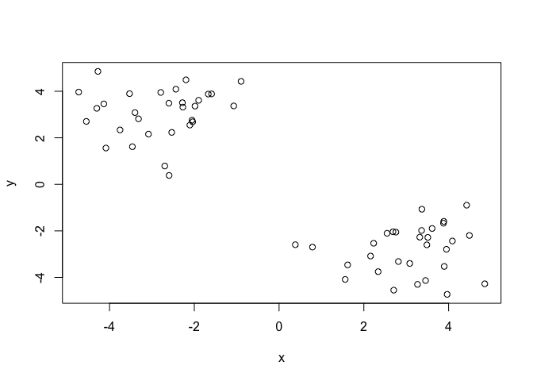
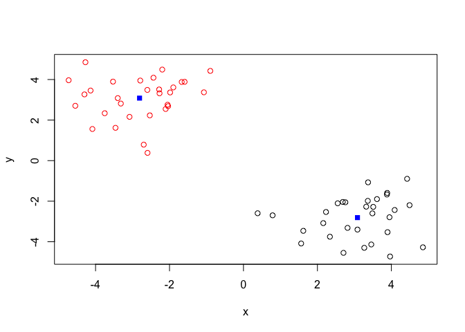
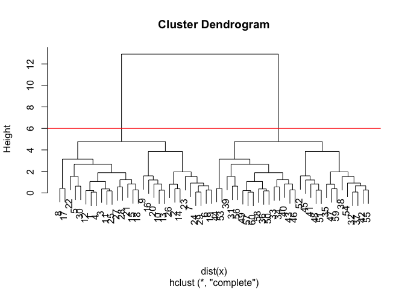
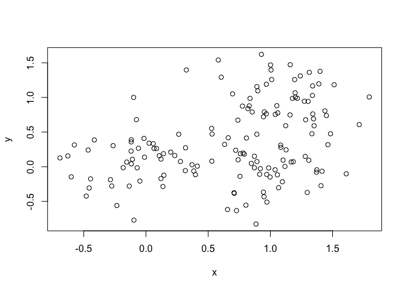
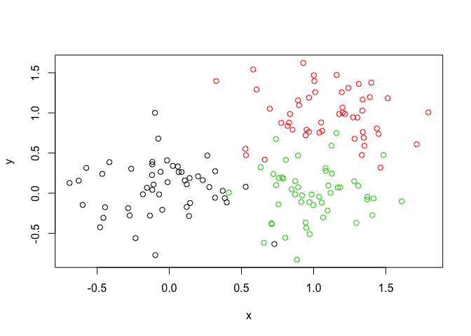
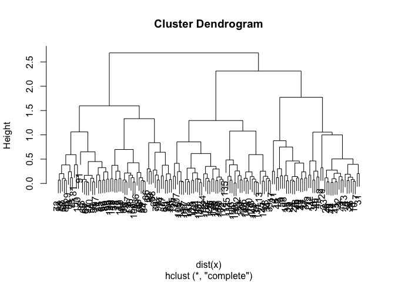
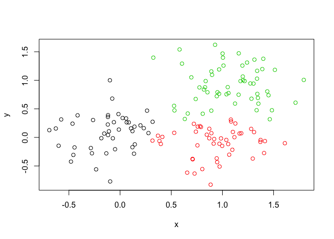
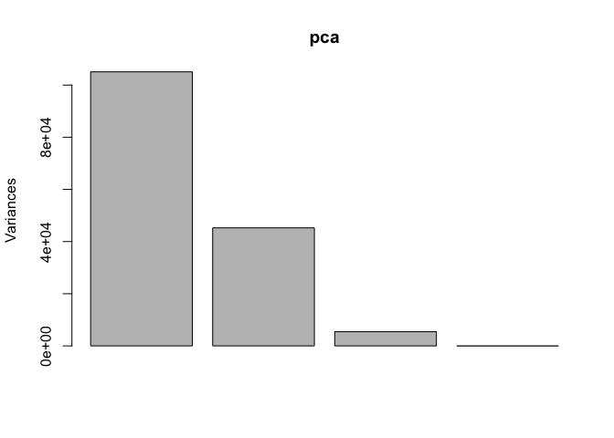
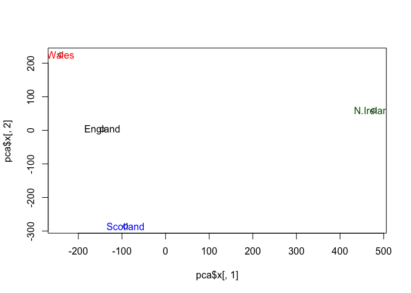

Class09
================
Joseph Herdy
2/5/2020

### K-Means Clustering

\#trying some kmeans() functions in R to cluster some made up example
data

``` r
tmp <- c(rnorm(30,-3), rnorm(30,3))
x <- cbind(x=tmp, y=rev(tmp))

plot(x)
```

<!-- -->

Use kmeans function setting k to 2 and nstart=20

``` r
km <- kmeans(x, centers = 2, nstart = 20)

km
```

    ## K-means clustering with 2 clusters of sizes 30, 30
    ## 
    ## Cluster means:
    ##           x         y
    ## 1  3.083033 -2.810420
    ## 2 -2.810420  3.083033
    ## 
    ## Clustering vector:
    ##  [1] 2 2 2 2 2 2 2 2 2 2 2 2 2 2 2 2 2 2 2 2 2 2 2 2 2 2 2 2 2 2 1 1 1 1 1 1 1 1
    ## [39] 1 1 1 1 1 1 1 1 1 1 1 1 1 1 1 1 1 1 1 1 1 1
    ## 
    ## Within cluster sum of squares by cluster:
    ## [1] 63.20941 63.20941
    ##  (between_SS / total_SS =  89.2 %)
    ## 
    ## Available components:
    ## 
    ## [1] "cluster"      "centers"      "totss"        "withinss"     "tot.withinss"
    ## [6] "betweenss"    "size"         "iter"         "ifault"

what is in object km?

``` r
attributes(km)
```

    ## $names
    ## [1] "cluster"      "centers"      "totss"        "withinss"     "tot.withinss"
    ## [6] "betweenss"    "size"         "iter"         "ifault"      
    ## 
    ## $class
    ## [1] "kmeans"

whats the size of the kmeans?

``` r
km$size
```

    ## [1] 30 30

what are the cluser
    assignment/membership?

``` r
km$cluster
```

    ##  [1] 2 2 2 2 2 2 2 2 2 2 2 2 2 2 2 2 2 2 2 2 2 2 2 2 2 2 2 2 2 2 1 1 1 1 1 1 1 1
    ## [39] 1 1 1 1 1 1 1 1 1 1 1 1 1 1 1 1 1 1 1 1 1 1

let’s check how many 2’s and 1’s there are in this vector with the
table() function

``` r
table(km$cluster)
```

    ## 
    ##  1  2 
    ## 30 30

plot x colored by the kmeans cluster assignment and add cluster centers
as bluer points

``` r
plot(x, col=km$cluster) #plot the kmeans, color by cluster (2 clusters)
points(km$centers, col = "blue", pch = 15) #add in the point to label center of cluster
```

<!-- -->

## Hierarchical clustering in R

hclust() boiiiiiiiiii. Main hier clustering method in R, must be passed
a distance matrix as input, not your raw data\!

``` r
hc <- hclust(dist(x))
hc
```

    ## 
    ## Call:
    ## hclust(d = dist(x))
    ## 
    ## Cluster method   : complete 
    ## Distance         : euclidean 
    ## Number of objects: 60

``` r
plot(hc) 
abline(h=6, col = "red")
```

<!-- -->

You can cut the tree at a given height to get the number of clusters you
want

``` r
cutree(hc, h=6)
```

    ##  [1] 1 1 1 1 1 1 1 1 1 1 1 1 1 1 1 1 1 1 1 1 1 1 1 1 1 1 1 1 1 1 2 2 2 2 2 2 2 2
    ## [39] 2 2 2 2 2 2 2 2 2 2 2 2 2 2 2 2 2 2 2 2 2 2

``` r
table(cutree(hc, h=3.5))
```

    ## 
    ##  1  2  3  4  5  6 
    ## 16  9  5 16  9  5

You can also cutree with a given number of ‘k’
    groups

``` r
cutree(hc, k = 5)
```

    ##  [1] 1 2 1 1 1 2 2 1 2 2 1 1 2 2 1 2 1 1 2 2 1 1 2 2 1 2 1 1 2 1 3 4 3 3 4 3 4 4
    ## [39] 3 3 5 4 3 3 5 3 4 5 3 3 5 5 3 4 4 3 3 3 4 3

``` r
table(cutree(hc, k = 5))
```

    ## 
    ##  1  2  3  4  5 
    ## 16 14 16  9  5

``` r
# Step 1. Generate some example data for clustering
x <- rbind(
 matrix(rnorm(100, mean=0, sd=0.3), ncol = 2), # c1
 matrix(rnorm(100, mean=1, sd=0.3), ncol = 2), # c2
 matrix(c(rnorm(50, mean=1, sd=0.3), # c3
 rnorm(50, mean=0, sd=0.3)), ncol = 2))
colnames(x) <- c("x", "y")
# Step 2. Plot the data without clustering
plot(x)
```

<!-- -->

``` r
# Step 3. Generate colors for known clusters
# (just so we can compare to hclust results)
col <- as.factor( rep(c("c1","c2","c3"), each=50) )
plot(x, col=col)
```

<!-- -->

Q. Use the dist(), hclust(), plot() and cutree() functions to return 2
and 3 clusters Q. How does this compare to your known ‘col’ groups?

``` r
hc_diy <- hclust(dist(x))
plot(hc_diy)
```

<!-- -->

``` r
grp3 <- cutree(hc_diy, k =3)
table(grp3)
```

    ## grp3
    ##  1  2  3 
    ## 44 49 57

``` r
plot(x, col=grp3) #color points by the cutree cluster assignments
```

<!-- -->

## Hands on PCA english food biz

``` r
x <- read.csv("UK_foods.csv",row.names = 1)
dim(x)
```

    ## [1] 17  4

``` r
x
```

    ##                     England Wales Scotland N.Ireland
    ## Cheese                  105   103      103        66
    ## Carcass_meat            245   227      242       267
    ## Other_meat              685   803      750       586
    ## Fish                    147   160      122        93
    ## Fats_and_oils           193   235      184       209
    ## Sugars                  156   175      147       139
    ## Fresh_potatoes          720   874      566      1033
    ## Fresh_Veg               253   265      171       143
    ## Other_Veg               488   570      418       355
    ## Processed_potatoes      198   203      220       187
    ## Processed_Veg           360   365      337       334
    ## Fresh_fruit            1102  1137      957       674
    ## Cereals                1472  1582     1462      1494
    ## Beverages                57    73       53        47
    ## Soft_drinks            1374  1256     1572      1506
    ## Alcoholic_drinks        375   475      458       135
    ## Confectionery            54    64       62        41

Make some conventional plots

``` r
barplot(as.matrix(x), beside=T, col=rainbow(nrow(x)))
```

<!-- -->

``` r
pairs(x, col=rainbow(10), pch=16)
```

<!-- -->

PCA time, bish

``` r
pca <- prcomp( t(x))
plot(pca)
```

<!-- -->

``` r
summary(pca)
```

    ## Importance of components:
    ##                             PC1      PC2      PC3       PC4
    ## Standard deviation     324.1502 212.7478 73.87622 4.189e-14
    ## Proportion of Variance   0.6744   0.2905  0.03503 0.000e+00
    ## Cumulative Proportion    0.6744   0.9650  1.00000 1.000e+00

``` r
attributes(pca)
```

    ## $names
    ## [1] "sdev"     "rotation" "center"   "scale"    "x"       
    ## 
    ## $class
    ## [1] "prcomp"

``` r
plot(pca$x[,1], pca$x[,2])
text(pca$x[,1], pca$x[,2], labels = colnames(x),
     col=c("black", "red", "blue", "darkgreen"))
```

<!-- -->
